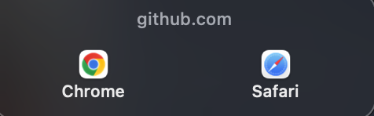

# LinkChoice

A tiny macOS app that becomes your default web browser and, instead of
opening links directly, shows a small picker right at your cursor so you can
choose which browser handles each one.



*(what you see when you click any link, anywhere on the system)*

## Why

macOS only lets you have one default browser. If you're signed into
different accounts in Chrome vs. Safari (work vs. personal, or juggling an
OAuth flow that needs a specific logged-in session — MCP tools, Supabase,
etc.), every link click is a coin flip on which browser — and which
account — it lands in. LinkChoice asks, every time, in under a second.

## How it works

- Registers as a handler for the `http`/`https` URL schemes via
  `CFBundleURLTypes` in `Info.plist`.
- Once set as your default browser, macOS delivers a `GetURL` Apple Event
  for every link clicked anywhere in the OS (Mail, Slack, Messages, any
  app). `NSAppleEventManager` listens for exactly that.
- On receiving a URL, it draws a small borderless panel at your current
  mouse position with a button per installed browser (icon + name, real
  `NSWorkspace` lookups — no hardcoded paths).
- Whichever you click, it forwards the URL to that browser via
  `NSWorkspace.open(_:withApplicationAt:)` and gets out of the way.
- Click outside the panel or hit Escape to dismiss without opening
  anything.

No daemon, no polling, no telemetry. It does nothing until macOS wakes it
up for a link — its only other visible surface is a small menu bar icon
(a cursor-click glyph) for settings.

## Menu bar

Click the cursor-click icon in your menu bar for:
- **Per-browser toggles** — check/uncheck any installed browser to
  show/hide it in the picker, no rebuild needed. (You can't disable every
  browser — the last one stays checked.)
- **Launch at Login**
- **Set as Default Browser…** — does the `NSWorkspace` call for you (see
  below for why this needs a properly signed build to actually take)
- **View on GitHub**, **Quit**

## Build & install

Requires Xcode command line tools (for `swift build` and `codesign`) and
macOS 13+.

```sh
git clone https://github.com/andrewneuwirth/LinkChoice.git
cd LinkChoice
./build.sh
```

This builds a release binary, assembles a real `.app` bundle, ad-hoc signs
it, registers it with Launch Services, and installs it to
`/Applications/LinkChoice.app`.

### Setting it as your default browser

**⚠️ Ad-hoc signing is not enough.** As of recent macOS versions, Launch
Services silently refuses to assign default-browser status to an app that
isn't signed with a real Apple Developer ID — this isn't just a System
Settings display filter, the actual OS-level assignment is rejected even
via CLI tools like `duti`. You'll need your own (free or paid) Apple
Developer ID to sign it properly:

```sh
codesign --force --deep --options runtime \
  --sign "Developer ID Application: YOUR NAME (TEAMID)" \
  /Applications/LinkChoice.app
```

If you have a paid Apple Developer Program membership, you should also
notarize + staple it — this is what actually made the System Settings
picker (and Launch Services' default-handler assignment) accept the app in
testing:

```sh
ditto -c -k --keepParent /Applications/LinkChoice.app LinkChoice.zip
xcrun notarytool submit LinkChoice.zip --keychain-profile "your-profile" --wait
xcrun stapler staple /Applications/LinkChoice.app
```

Then set it as default: click the menu bar icon → **Set as Default
Browser…**. The System Settings GUI picker can be stale/cached even after
a proper signed+notarized build — that menu action uses the modern
`NSWorkspace` API directly instead, which is what actually took effect in
testing when the GUI list didn't.

If you'd rather do it by hand (or you're scripting a fresh install), the
same call:

```swift
NSWorkspace.shared.setDefaultApplication(
    at: URL(fileURLWithPath: "/Applications/LinkChoice.app"),
    toOpenURLsWithScheme: "https"
) { error in print(error ?? "done") }
```

(Also call it for `"http"` — do the two calls a second or so apart, not
back-to-back, or the second one can hit a transient Launch Services rate
limit.)

(Also run it for `"http"`.) A one-off Swift script via `swift script.swift`
works fine for this — see the commit history / issues for a ready-made one
if you don't want to write it yourself.

## Adding more browsers than just Chrome/Safari

Everything lives in one array — `candidateBrowsers` near the top of
`Sources/LinkChoice/main.swift`:

```swift
let candidateBrowsers: [Browser] = [
    Browser(name: "Chrome", bundleID: "com.google.Chrome"),
    Browser(name: "Safari", bundleID: "com.apple.Safari"),
]
```

Add a line per browser you want in the picker — `name` is just the label
shown under the icon, `bundleID` is how macOS identifies the app. A browser
you don't have installed is silently skipped (no blank/broken button), so
it's safe to list ones you might install later.

**Bundle IDs for common browsers:**

```swift
Browser(name: "Firefox", bundleID: "org.mozilla.firefox"),
Browser(name: "Arc", bundleID: "company.thebrowser.Browser"),
Browser(name: "Brave", bundleID: "com.brave.Browser"),
Browser(name: "Edge", bundleID: "com.microsoft.edgemac"),
Browser(name: "Opera", bundleID: "com.operasoftware.Opera"),
Browser(name: "Vivaldi", bundleID: "com.vivaldi.Vivaldi"),
Browser(name: "Orion", bundleID: "com.kagi.kagimacOS"),
Browser(name: "DuckDuckGo", bundleID: "com.duckduckgo.macos.browser"),
```

**Don't see your browser above, or want to double-check an ID?** Ask macOS
directly — this works for any installed app, not just browsers:

```sh
mdls -name kMDItemCFBundleIdentifier -r "/Applications/Your Browser.app"
```

Reorder the array to change button order (left to right = array order).
Rebuild after any change:

```sh
./build.sh
```

Restart LinkChoice for the change to take effect if it's already running
(`build.sh` does this automatically — it kills and relaunches).

## Prior art

If LinkChoice isn't the right shape for you:
- **[Finicky](https://github.com/johnste/finicky)** — free, open source,
  actively maintained. Rule-based (JS/TS config) rather than a popup —
  routes automatically instead of asking each time.
- **[Velja](https://sindresorhus.com/velja)** — closed source, $8. Closest
  UX match to LinkChoice (a popup picker), by Sindre Sorhus.
- **[BrowserPicker](https://github.com/ealeksandrov/BrowserPicker)** —
  another small open-source picker.

## License

MIT — see [LICENSE](LICENSE).
